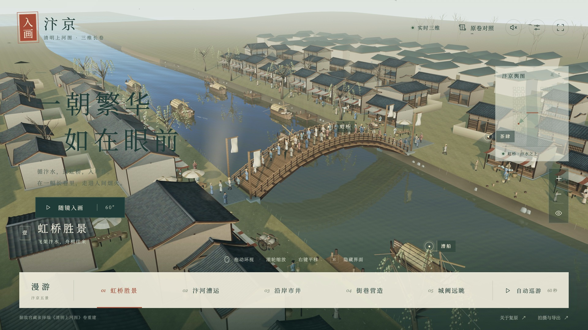

# 入画·汴京｜GPT-6 Astra 实践测试

一次围绕 **GPT-6 Astra 实际使用体验**展开的项目：把《清明上河图》中的虹桥、汴河与沿岸市井，做成能在浏览器里自由观察、点击探索、录制展示的三维网页。

从需求澄清、程序建模到交互、性能优化和原生 4K 录像，仓库保留实际代码、模型、提示词整理与实现说明，方便对照成果，了解模型完成了什么、仍有哪些不足。



**[详细提示词](docs/提示词与迭代流程.md) · [部署指南](docs/部署指南.md) · [实现原理](docs/实现原理.md) · [模型与音乐重建](docs/重建指南.md) · [4K 录制与剪辑](docs/录制与视频制作.md)**

## 可以体验什么

| 内容 | 已实现的效果 |
|---|---|
| 三维场景 | 编木虹桥、汴河、91 栋重点建筑及远景街区、124 名人物、8 艘舟船 |
| 自由漫游 | 鼠标环视、缩放、平移，键盘移动，点击舆图定位 |
| 五处景点 | 虹桥胜景、汴河漕运、沿岸市井、街巷营造、城阙远眺 |
| 点击探索 | 虹桥、漕船、茶肆标签；简介弹窗与“走近看看” |
| 实时表现 | 水面倒影与细波、船体轻摇、人物关节运动、布幌、柳枝、轻烟与飞鸟 |
| 画面设置 | 三种时辰、画质档位、动画暂停、标签开关、模型线框 |
| 参考资料 | 横向浏览原卷、复原范围说明、故宫馆藏资料入口 |
| 拍摄 | 4K PNG、60 秒场景巡游、包含真实界面和鼠标操作的原生 4K 网页录像 |

页面主要内容由 Three.js / WebGL 实时绘制。GLB 中保存三维网格，动画与相机在浏览器中计算；原卷图片用于资料对照。视频素材来自实际运行的网页。

## 三步在本机运行

安装 [Node.js](https://nodejs.org/)（本项目使用 **24.x**；版本要求见 `package.json`），然后运行：

```sh
git clone https://github.com/Rising1234Sun/qingmingshanghetu.git
cd qingmingshanghetu
npm ci
npm run dev
```

打开终端显示的 **http://127.0.0.1:5187/**。首次加载需要解码约 12.2 MiB 的模型，请等待进度完成。建议使用开启硬件加速、支持 WebGL 2 的桌面浏览器。

模型、纹理、字体、解码器和网页配乐已包含在仓库中。**只运行网页，无需安装 Blender、Python，也无需 API Key。** 依赖安装完成后可以断网运行。

构建并启动本地成品：

```sh
npm run build
npm run check -- --dist dist
npm start
```

成品地址为 **http://127.0.0.1:5186/**；本地录制文件写入 `output/web/`。macOS 也可在完成构建后双击 `打开汴京.command`。请通过 HTTP 打开，不要直接双击 `dist/index.html`。

## 如何操作

| 操作 | 作用 |
|---|---|
| 左键拖动 / 单指拖动 | 环视 |
| 滚轮 / 双指缩放 | 拉近、拉远 |
| 右键拖动 / 双指平移 | 移动观察中心 |
| W、A、S、D / 方向键 | 水平移动，Shift 加速 |
| 底部景点 / 舆图 | 切换景点 / 定位 |
| 画面中的标签 | 查看简介，再点击“走近看看” |
| 空格 / 自动巡游 | 开始、结束六镜头巡游 |
| H | 隐藏、恢复界面 |
| Esc | 结束当前录制；其他状态下退出巡游或关闭弹窗 |

鼠标操作会退出自动巡游。自由观察没有建筑碰撞约束，过近时可向外移动。浏览器会要求用户先点击按钮才能播放音乐。

## 部署到网站

这是纯静态网页，构建产物为 `dist/`。仓库提供 GitHub Actions 构建校验与 GitHub Pages 部署工作流。

1. 把仓库放到自己的 GitHub 账号。
2. 在 **Settings → Pages → Build and deployment → Source** 选择 **GitHub Actions**。
3. 推送到 `main`，或在 Actions 中手动运行“部署网页到 GitHub Pages”。

工作流根据 Pages 配置设置资源前缀，兼容仓库子路径。普通静态托管也可直接发布默认 `npm run build` 生成的 `dist/`。HTTPS 静态网站上的媒体导出走浏览器下载，不需要服务器写入接口。

完整的本地部署、GitHub Pages、Nginx、子目录部署及排错步骤见 [部署指南](docs/部署指南.md)。

## 实现结构

```text
src/                         网页交互、实时渲染、巡游、录像
public/                      可直接运行的 GLB、纹理、配乐、字体、Draco
assets/                      人体基础、原始贴图，以及完整字体的下载清单
scripts/build_web_scene.py   Blender 程序建模入口
scripts/export_web.py        顶点遮蔽、静态合批、Draco GLB 导出
scripts/compose*.py          原创编曲与本地音频合成
scripts/edit_showcase_4k.py  两分钟 4K 网页展示剪辑
scripts/serve.mjs            仅绑定本机的成品服务与媒体保存
docs/                       提示词、实现、部署、重建、历史验收记录
.github/workflows/          构建校验、Pages 部署
```

Blender Python 先生成可编辑场景；导出器合并静态几何并压缩模型；Three.js 加载模型后处理光照、水面、人物与船只动画；HTML/CSS 提供中文界面。完整网页录制把连续的 WebGL 画面与实际 DOM 状态合成，再由 FFmpeg 裁切、排版和编码。

## 关于这次 Astra 测试

这是一段经过反馈与修订的制作过程：最初讨论离线短片，随后明确核心成果是交互网页，再补全功能展示，最后针对模糊问题重新进行 4K 采集。提示词文档按这些阶段整理，**不把最终成果描述为一次输入就完成**。

本次开发与录制主要使用 Apple M4、16 GB 内存。用户在前期成果阶段记录的消耗约为 Pro 5 套餐周额度的 20%；这是个人使用记录，不包含后续全部修改，也不是独立计量的通用成本或速度基准。

适合直接检验的内容包括：源码能否启动、模型是否真实三维、按钮是否可用、近景细节、浏览器帧率、4K 原始文件像素，以及文档能否帮助他人重建。

## 视频与仓库内容

当前主视频规格为 **2160×3840、120 秒、24 fps、无配乐**。实测主文件包含 2880 帧，平均视频码率约 35.3 Mbps；来源是重新采集的 3840×2160 网页录像。这里的 24 fps 是剪辑输出帧率，源录像的实测编码帧率约为 22.15 fps。

Git 仓库包含完整网页运行资产与制作脚本，**不上传生成的视频**。原始录像、4K 成片、`.blend`、渲染序列和安装包保留在本地。重建用的完整中文字库、原始长卷和采样 WAV 按需从公开来源下载，提供校验清单；网页使用的轻量字体、参考图和配乐已随仓库提供。可通过 [重建指南](docs/重建指南.md) 生成 Blender 工程并恢复音乐依赖，再录制自己的网页操作。原始录像属于实际操作结果，无法只靠源码自动重现每一次鼠标输入。

## 目前的不足

- **复原与画面细节**：重点重建虹桥和沿河市井，尚未逐一还原完整原卷；背面、尺度和部分街巷属于空间推定，远景较简化，整体仍与实拍级效果有距离。
- **人物、漫游与性能**：人物动作仍有程序循环的规律感，自由相机缺少完整碰撞检测，近距离可能进入建筑；高画质和 4K 录制对设备性能要求较高，实际帧率存在限制。
- **视频清晰度**：作者在发布抖音后的反馈是，当前 4K 视频仍有模糊感，文字和场景细节的观感不如直接打开网页后进行屏幕录制，清晰度仍需改进。
- **竖屏适配**：作者使用 iPhone 15 Pro Max，经剪映按 9:16 调整并发布后，发现边缘文字和部分画面显示不完整。现有版式对二次剪辑和手机展示的适配仍不足，需要优化缩放与边缘安全区。

后两项为作者实际使用反馈，具体清晰度损失与裁切环节尚待进一步核验，当前不能视为已经解决。

## 效果边界与素材

依据 [故宫藏张择端本](https://www.dpm.org.cn/collection/paint/228226.html)，重点表现虹桥与汴河市井。背面、空间尺度和部分街巷属于艺术推定；远景采用简化模型，人物仍有程序动作的重复感。当前是实时三维艺术重建，尚未达到完整原卷逐物考证或实拍级效果。

第三方素材、软件与授权记录见 [素材来源](docs/素材来源.md)。CC0、OFL、MIT、Apache 等许可文件随相应素材保留；不要把第三方许可理解为整个仓库已统一采用同一种开源许可。
