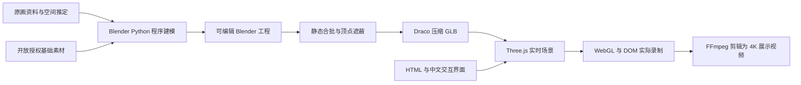

# 实现原理

这个项目把制作阶段与运行阶段分开：Blender Python 生成几何，Three.js 在浏览器中持续计算画面，网页 UI 与录制系统直接围绕实时场景工作。

## 建模与场景组织

`scripts/build_web_scene.py` 是当前网页版的建模入口，固定随机种子，调用 `geometry.py`、`scenery.py`、`people.py`，生成 `汴京网页版.blend`。旧的 `build_scene.py` 用于早期离线影片，不是当前主入口。

- `geometry.py`：网格、梁段、柱体、曲线、实例与材质等基础构件。
- `scenery.py`：虹桥、民居、船只、招牌、摊位和植物等场景部件。
- `people.py`：读取 MakeHuman 基础网格，结合衣饰和父子关节构造人物。
- `build_web_scene.py`：决定布局、建筑开间、街市道具、人船位置及整体密度。

近景使用独立几何表现桥板、交叠木梁、瓦片、窗棂和器物。91 栋重点建筑、124 名人物的记录在 `docs/网页重建.json`；运行时还会添加简化远景建筑。这些数量描述当前工程，不代表原卷中所有对象都已逐一复原。

## GLB 导出

`scripts/export_web.py` 从 `.blend` 中提取网页资产：

1. 给人物、船只、柳梢、手臂、腿和旗幡添加 `web_kind` 等自定义属性。
2. 清除离线相机、灯光、体积和原水面；这些效果在网页重新实现。
3. 清除离线关键帧，保留父子层级、基础变换、运动参数。
4. 按材质与三段空间区域合并静态对象，保留可视锥剔除的空间粒度。
5. 调用 `bake_web_ao.py` 计算静态顶点遮蔽。
6. 输出 Draco 压缩 GLB，保留 glTF `extras`，写入模型清单。

当前清单记录 77 个静态批次、约 12.2 MiB GLB。Draco 只负责压缩几何，浏览器通过仓库内的 WASM 解码器还原网格。修改建模脚本后要重新导出，网页不会实时执行 Python。

## 网页加载与坐标

`src/world.js` 用 `GLTFLoader` 和 `DRACOLoader` 加载模型，遍历 `userData.web_kind` 收集动态对象。Blender 的 `(x, y, z)` 通过 `toWorld(x, y, z) = (x, z, -y)` 转成网页坐标；相机目标和新增效果统一使用此转换。

`src/paths.js` 把模型、纹理、解码器、音乐和动态简介图片接到 Vite 的 `BASE_URL`。HTML 与 CSS 的静态引用由 Vite 处理，因此同一份源码能部署在根目录或 GitHub Pages 仓库子路径。

## 材质、光照与特效

网页会补充木纹、地面、布料和灰泥表面。部分材质用 `onBeforeCompile` 注入采样及法线细节，旗幡通过顶点位移模拟风动。皮肤和眼球使用基础网格的 UV 与贴图。

太阳、天空环境与雾共同决定清晨、暖日、暮色三种氛围。输出使用 ACES 色调映射与 sRGB；后期包含输出转换和 FXAA，极致画质再启用 SSAO。静态顶点遮蔽与动态屏幕空间遮蔽是不同层次的补充。

水面使用 Three.js Water 的平面反射与法线扰动。高画质按间隔更新反射，低画质关闭反射和太阳阴影以减少成本。烟采用透明精灵，柳枝、旗幡、鸟类与舟船通过时间函数更新。它们是实时视觉近似，没有模拟完整流体或布料物理。

## 动态对象与性能取舍

人物关节随相位摆动，行人沿桥面或河岸路线移动，船体轻摇并沿河道运动。不同对象使用错开的相位。模型共享网格；重复对象通过 `InstancedMesh` 绘制，动态实例矩阵随对象变换更新。

另外采用静态矩阵、分区合批、阴影与水面反射降低更新频率、画质档位以及远景简化。与逐对象高精度绘制相比，这些措施降低开销，但也带来远景细节减少、运动阴影更新较慢等取舍。

主循环在页面隐藏时暂停，并限制异常大的帧间隔。性能读数来自 `renderer.info` 与当前运行的帧计数，不能把网页帧率直接等同于 MediaRecorder 实际编码帧率。

## 交互和相机

`src/main.js` 负责 UI 状态、事件、图形初始化、后期、音频、标签投影和主循环；`src/tour.js` 管理五个景点与六段自动巡游。

景点切换同时插值相机位置与观察目标，并增加中途高度避免直接穿越低矮建筑。OrbitControls 处理拖动、缩放和平移；键盘移动平移相机与目标。标签将三维坐标投影为屏幕位置，并按相机距离和可见范围显示。

相机有角度、距离与最低高度约束，但没有完整碰撞检测。舆图是可点击的二维示意图，表示观察中心与方向，不是逐栋建筑等比例地图。

## 两套录制路径

| 路径 | 场景巡游录制 | 完整网页操作录制 |
|---|---|---|
| 文件 | `src/recording.js` | `src/interface-recording.js` |
| 内容 | WebGL 画布与原创音乐 | WebGL、实际 DOM、鼠标、点击提示 |
| 用途 | 纯三维运镜展示 | 网站能力与操作过程演示 |
| 当前采集尺寸 | 1920×1080 或 1080×1920 | 可选长边 1920 或 3840，保持页面比例 |
| 音频 | Web Audio 接入配乐 | 默认无声 |

完整录制用 html-to-image 把真实 DOM 转成缓存图层，连续 WebGL 画面与它合成。DOM 更新比三维帧慢，降低字体和排版反复采集的成本；原生下拉菜单、浏览器边框及其他应用不在采集范围内。

选择 4K 时，会同步扩大真正的 WebGL 缓冲区和 DOM 采样比例，再交给 MediaRecorder 编码。采集流请求 60 fps；最终帧率取决于浏览器、设备和场景，不保证每次输出 60 fps。剪辑脚本再按时间戳输出固定 24 fps，不使用生成式补帧。

## 后期与音频

`scripts/edit_showcase_4k.py` 的 `ROWS` 定义取材时间、时长、标题与细节裁切区域。每段从同一源帧生成完整网页窗口和细节窗口，版式文字按 2160×3840 绘制，最终拼接两分钟成片。视频编码和帧数检查由 `imageio-ffmpeg` 提供的 FFmpeg 完成。

`compose.py` 与 `compose_demo.py` 分别生成 60 秒、120 秒原创编曲：96 BPM、五声音阶主题、开放授权管弦采样与程序拨弦，配合本地合成环境音。音乐不属于北宋乐曲复原。

修改方法与准确执行顺序见 [重建指南](重建指南.md)；原生 4K 录制、素材位置与验收见 [录制与视频制作](录制与视频制作.md)。
